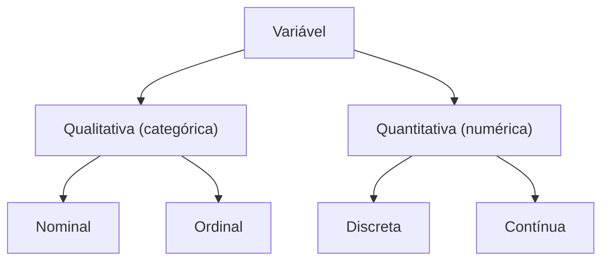

# Tipos de variáveis

Reconhecer o tipo de cada variável é o **primeiro passo** ao analisar qualquer conjunto de dados. O tipo determina:

- quais gráficos fazem sentido;
- quais medidas resumir (média? proporção?);
- qual teste estatístico usar.

## Mapa geral

## Variáveis qualitativas (categóricas)

Representam **categorias**, não números (ainda que possam ser codificadas como números).

### Nominais

Categorias **sem ordem natural**.

- Sexo: masculino, feminino;
- Tipo sanguíneo: A, B, AB, O;
- Espécie: cão, gato, hamster;
- Estado civil.

### Ordinais

Categorias **com ordem natural**, mas sem distância definida entre elas.

- Grau de dor: leve, moderada, intensa;
- Escolaridade: fundamental, médio, superior;
- Estágio de câncer: I, II, III, IV.

> Atenção: ordinal **não é** o mesmo que numérico. A diferença entre "leve" e "moderada" não é necessariamente igual à diferença entre "moderada" e "intensa".

## Variáveis quantitativas (numéricas)

Representam **quantidades** mensuráveis.

### Discretas

Assumem valores **isolados** — tipicamente contagens.

- Número de filhos;
- Número de células em um campo de microscópio;
- Contagem de mutações em uma sequência de DNA.

### Contínuas

Podem assumir qualquer valor dentro de um intervalo — limitadas só pela precisão do instrumento.

- Peso, altura;
- Pressão arterial;
- Concentração de uma proteína no plasma;
- Tempo de sobrevida.

## Resumo

| Tipo | Exemplo | Resumo usual | Gráfico usual |
| --- | --- | --- | --- |
| Nominal | tipo sanguíneo | frequências, proporções | barras, pizza |
| Ordinal | grau de dor | mediana, frequências | barras |
| Discreta | nº de células | média, mediana | barras, histograma |
| Contínua | altura | média, desvio padrão | histograma, boxplot |
