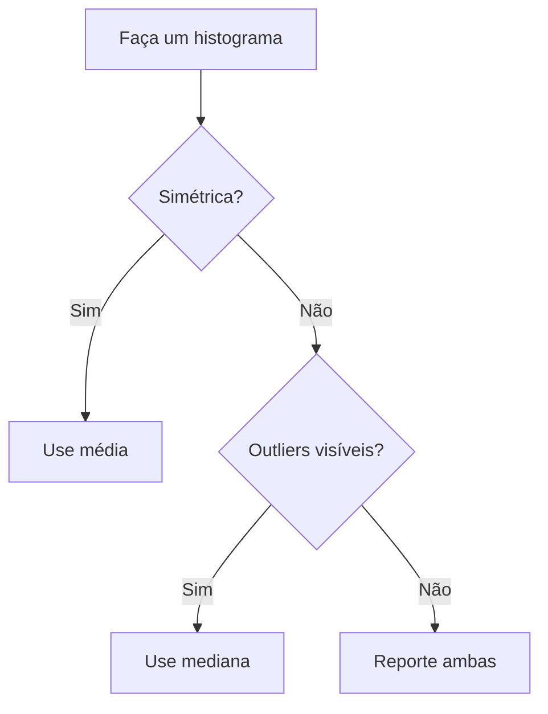

# Média x mediana

Qual delas reportar? A escolha depende da **forma da distribuição** e da **presença de outliers**.

## Em distribuição simétrica

Em uma distribuição simétrica (como a normal), média e mediana **coincidem**:

$$
\bar{x} \approx \text{mediana} \approx \text{moda}
$$

Nesse caso, tanto faz qual usar — costuma-se reportar a média porque tem propriedades matemáticas mais convenientes (se combina bem com soma, ANOVA, intervalos de confiança, etc.).

## Em distribuição assimétrica

A média é **puxada para a cauda**. A mediana fica mais perto do "centro de massa" da maior parte dos dados.

### Assimetria à direita (cauda longa para valores altos)

$$
\bar{x} > \text{mediana}
$$

Exemplos: renda, tempo de espera, número de citações de um artigo, contagens de vírus.

### Assimetria à esquerda (cauda longa para valores baixos)

$$
\bar{x} < \text{mediana}
$$

Exemplos: notas em provas muito fáceis, idade ao morrer (a maioria morre na velhice, com cauda nos jovens).

## Como decidir na prática

A regra de ouro: **sempre olhe o histograma antes de escolher**.

## Em artigos científicos

| Tipo de dado | Reporte |
| --- | --- |
| Pressão arterial, altura | média ± desvio padrão |
| Tempo de sobrevida | mediana (IC 95%) |
| Idade dos participantes (geralmente simétrico) | média ± desvio padrão |
| Salário, dose, contagens raras | mediana (IQR) |

> Atenção: a mediana costuma vir acompanhada do **intervalo interquartil (IQR)** ou de outros percentis, em vez de desvio padrão.

## Um cuidado especial

Algumas vezes, médias podem ser **enganosas**:

- Uma média de "renda per capita" alta pode mascarar uma realidade em que 90% das pessoas ganham muito pouco — basta ter alguns poucos muito ricos.
- A média de "tempo gasto em uma rede social" pode esconder que a maioria das pessoas usa muito menos do que a média sugere.

Por isso, em comunicação científica e jornalística, a mediana frequentemente conta uma história mais honesta sobre o "indivíduo típico".
